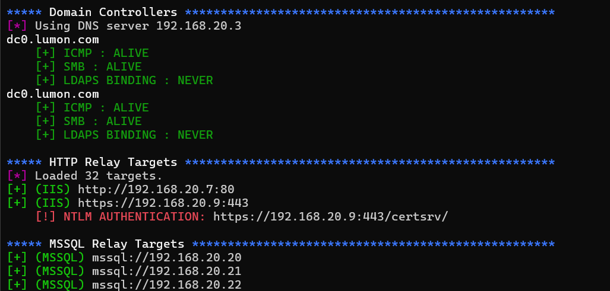

# tango - find NTLM relay targets

Scan internal networks to reveal NTLM relay targets:
- LDAPS without Channel binding
- HTTP/S relays (ADCS/SCCM)
- MSSQL servers



## Usage

```
tango - find NTLM relay targets

options:
  -h, --help        show this help message and exit
  -d company.local  Domain name (company.local).
  -ns NS            DNS server IP address.
  -p [ports]        Port list to test. Default is 80,443.
  -t [num]          Number of threads. Default is 10.
  -o tango-out.txt  Output file for alive hosts. Defaults to tango-out.txt.
  --debug           Show debug information.

targets:
  -r 10.10.10.0/24  Subnet range to scan (10.10.10.0/24)
  -rf subnets.txt   Subnet ranges file (10.10.10.0/24, 10.10.11.0/24, etc.)
  -tf hosts.txt     Newline-delimited single target file (10.10.10.10, 10.10.10.11, etc.)
```

## Credits

The LDAPS channel binding check is taken from zyn3rgy's awesome tool [LdapRelayScan](https://github.com/zyn3rgy/LdapRelayScan)
